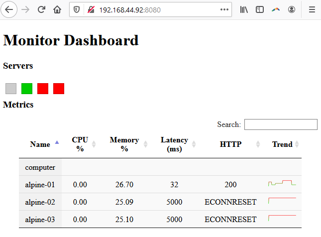

# Monitoring

In this workshop, we'll cover the basic principles related to establishing a monitoring infrastructure.  



### Concepts

Publish-subscribe vs. warehouse.  You get events, fire-n-forget vs. analyze stored high-fidelity metrics.

Fidelity vs. latency.

### Monitoring Architecture


## Workshop

### Before you start

Clone this repository.

Pull the following bakerx images.

```bash
# Updated to allow redis access from remote hosts
bakerx pull CSC-DevOps/Images#Spring2020 queues
bakerx pull CSC-DevOps/Images#Spring2020 alpine-node
```

Bring up the infrastructure.

```bash
cd Monitoring/servers
npm install
node index up
```

Inspect the console output for any errors, then confirm VMs have started in VirtualBox.


Open a terminal dedicated to the monitor instance and ssh into machine, `bakerx ssh monitor`.
Change into dashboard directory (which will be mounted at `/bakerx`), install packages, and start dashboard service.

```bash
cd /bakerx
npm install
node bin/www
```

Visit the monitoring dashboard at http://192.168.44.92:8080/. Confirm you can see the dashboard running.

## Monitoring framework

Explain how metrics flow here?

## Agent

You will need to complete building the monitoring agent, and then install it the servers being monitored.

### Task 1: Add memory/cpu metrics.

Update code.

Modify `function memoryLoad()` to calculate the amount of memory currently used by the system.
Modify `function cpuAverage()` to calculate the amount of load the cpu is under, between two successive samples.


Test out by registering your computer as client.

```
cd agent/
node index.js computer
```

Install on servers.

```bash
cd servers/
node index.js push
```

You should see memory/cpu information being displayed in dashboard.

### Task 2: Latency and HTTP status codes.

You have three servers running, on 9001, 9002, and 9003.


### Task 3: Calculate and display server health.

Start up apps.

### Task 4: Load services.

/work
/stackless

Can we kill with siege?

Siege is a tool for performing load testing of a site.

Download: https://www.joedog.org/siege-home/
Mac: `brew install siege` or `./configure; make; make install`
Windows: https://github.com/ewwink/siege-windows

If you run this command, you should see latency start to become red for middle service.
```
siege -b -t60s http://localhost:9001
```


### Task 5: New metric.

Add a new metric from agent to dashboard.

## Extra

### socket.io

A new technology that you have not been previously exposed to is [socket.io](http://socket.io/).


### setInterval

There is code running every 2 seconds that will broad cast basic stats to the web app:

``` js
	setInterval( function () 
	{
		io.sockets.emit('heartbeat', 
		{ 
			name: "Your Computer", 
			cpu: cpuAverage(), 
			memoryLoad: memoryLoad(),
			nodes: calculateColor()
		});
	
	}, 2000);
```


## Monkeys

### Latency Monkey

**Latency Monkey** induces artificial delays client-server communication layer to simulate service degradation and measures if upstream services respond appropriately. In addition, by making very large delays, you can simulate a node or even an entire service downtime (and test our ability to survive it) without physically bringing these instances down. This can be particularly useful when testing the fault-tolerance of a new service by simulating the failure of its dependencies, without making these dependencies unavailable to the rest of the system.

*Implement a basic Latency Monkey by introducing randomly large delays using a proxy to the three servers.*

### Chaos Monkey

**Chaos Monkey**, a tool that randomly disables our production instances to make sure we can survive this common type of failure without any customer impact. The name comes from the idea of unleashing a wild monkey with a weapon in your data center (or cloud region) to randomly shoot down instances and chew through cables -- all the while we continue serving our customers without interruption.

*Implement a basic Chaos Monkey by blocking routes to a specific server.*
